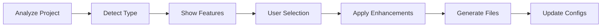

# Prjctzr MCP Server v2.0.0 🏗️

Professional project initialization and enhancement server that creates production-ready codebases with best practices, containerization, and DevAssist integration through the Model Context Protocol (MCP).

## 🌟 Overview

Prjctzr eliminates the tedious setup phase of new projects by instantly creating well-structured, production-ready codebases complete with testing, CI/CD, documentation, and optional AI assistance integration.

### Key Benefits
- **Instant Best Practices**: Every project starts production-ready
- **Multi-Language Support**: Node.js, Python, Go, Rust, and more
- **DevAssist Integration**: Seamless AI assistance setup
- **Beautiful CLI**: Interactive terminal experience
- **Smart Enhancement**: Add features to existing projects

## 🚀 Quick Start

### Installation

```bash
# Clone and install
git clone https://github.com/PerformanceSuite/Prjctzr.git
cd Prjctzr
npm install

# Make CLI available globally
npm link

# Start the server
npm start
```

### Claude Desktop Configuration

Add to `~/Library/Application Support/Claude/claude_desktop_config.json`:

```json
{
  "mcpServers": {
    "prjctzr": {
      "command": "node",
      "args": ["/path/to/Prjctzr/index.js"]
    }
  }
}
```

### CLI Usage

```bash
# Interactive project creation
prjctzr

# Or use in Claude Code
/prjctzr
```

## 📦 Features

### Project Types

| Type | Description | Frameworks |
|------|-------------|------------|
| **Node.js** | Backend applications | Express, Fastify, NestJS |
| **Python** | Web services & APIs | FastAPI, Django, Flask |
| **Go** | Microservices | Gin, Echo, Fiber |
| **Rust** | System applications | Actix, Rocket, Warp |
| **React** | Frontend SPAs | Create React App, Next.js |
| **Vue** | Progressive web apps | Vue 3, Nuxt |
| **Full-stack** | Complete applications | React + Node/Python |

### Feature Selection

Interactive menu for choosing enhancements:

```
📦 Available Enhancements
────────────────────────────────────────
  [✓] 1. DevAssist Integration - AI-powered development
  [✓] 2. Docker - Container support with best practices
  [✓] 3. CI/CD - Automated testing and deployment
  [✓] 4. Testing - Jest/Pytest with coverage
  [ ] 5. Dagger - Portable CI/CD pipelines
  [✓] 6. Documentation - Auto-generated docs
  [ ] 7. Kubernetes - Production deployment
  [ ] 8. Monitoring - Logging and metrics
```

### DevAssist Setup

When DevAssist is selected, Prjctzr automatically:

1. Creates `.devassist/` directory structure
2. Configures session management
3. Sets up specialized subagents
4. Initializes databases
5. Creates warmup templates
6. Configures cleanup rules

### Docker Integration

Professional containerization with:

- Optimized multi-stage Dockerfiles
- Docker Compose for development
- Health checks and restart policies
- Volume management
- Network configuration

### CI/CD Pipelines

Automated workflows for:

- **GitHub Actions**: Test, build, deploy
- **GitLab CI**: Pipeline with stages
- **Dagger**: Portable CI/CD as code
- **Jenkins**: Declarative pipelines

## 🏗️ Architecture

### Directory Structure
```
Prjctzr/
├── index.js                   # Main MCP server
├── bin/
│   └── prjctzr               # CLI executable
├── src/
│   ├── initializer/          # Project creation
│   │   └── initializer.js   # Core logic
│   ├── analyzer/             # Codebase analysis
│   │   └── analyzer.js      # Detection logic
│   ├── containers/           # Docker management
│   │   └── manager.js       # Container configs
│   ├── templates/            # Template system
│   │   └── manager.js       # Template engine
│   └── devassist-setup.js   # DevAssist integration
├── templates/                # Project templates
│   ├── node/
│   ├── python/
│   ├── go/
│   └── rust/
└── scripts/                  # Utility scripts
```

### Template System

Handlebars-based templating with:

```javascript
// Template variables
{
  projectName: "my-app",
  projectType: "node",
  features: ["docker", "testing", "devassist"],
  author: "Developer Name",
  license: "MIT"
}
```

### DevAssist Integration Module

Complete setup functionality:

```javascript
class DevAssistSetup {
  setupDevAssist(projectPath, config) {
    // Creates complete DevAssist infrastructure
    this.createDirectoryStructure();
    this.generateConfiguration();
    this.createSubagents();
    this.setupDocumentation();
    this.initializeDatabases();
  }
}
```

## 🛠️ Available Tools

### Core Tools

| Tool | Description |
|------|-------------|
| `prjctzr:init` | Create new project with wizard |
| `prjctzr:enhance` | Add features to existing project |
| `prjctzr:dockerize` | Add Docker support |
| `prjctzr:setup_ci` | Configure CI/CD pipelines |
| `prjctzr:create_template` | Generate custom template |

### Enhancement Flow



## 🎨 CLI Experience

### Interactive Wizard

```
╔═══════════════════════════════════════════════════════╗
║                  🚀 PRJCTZR v2.0                       ║
║          Professional Project Initializer              ║
╚═══════════════════════════════════════════════════════╝

📝 Project Configuration
──────────────────────────────────────────────────

1. Project name: awesome-api
2. Project type: Node.js
3. Location: /Users/dev/projects/awesome-api

🎯 Features
──────────────────────────────────────────────────
Select features for your project:

  [✓] DevAssist Integration
  [✓] Docker
  [✓] CI/CD
  [✓] Testing
  [ ] Dagger
  [✓] Documentation

Creating project...
  ✓ Directory structure
  ✓ Project files
  ✓ Docker configuration
  ✓ DevAssist setup
  ✓ CI/CD pipeline

✨ Project created successfully!
```

## 🧪 Testing

### Run Tests
```bash
npm test
```

### Test Project Creation
```bash
# Test all project types
node scripts/test-integration.js
```

## 📊 Generated Project Structure

### Example: Node.js with DevAssist

```
awesome-api/
├── src/
│   ├── index.js           # Entry point
│   ├── routes/            # API routes
│   ├── middleware/        # Express middleware
│   └── utils/             # Utilities
├── tests/
│   ├── unit/              # Unit tests
│   └── integration/       # Integration tests
├── .devassist/
│   ├── config.json        # DevAssist config
│   ├── sessions/          # Session data
│   ├── subagents/         # AI agents
│   └── docs/              # Documentation
├── .github/
│   └── workflows/
│       └── ci.yml         # GitHub Actions
├── docker/
│   └── Dockerfile         # Multi-stage build
├── docker-compose.yml     # Development setup
├── package.json           # Dependencies
├── .env.example           # Environment template
├── .gitignore            # Git ignores
└── README.md             # Documentation
```

## 🔧 Configuration

### Environment Variables
Create `.env` file:

```env
# Templates
DEFAULT_TEMPLATE_PATH=./templates
CUSTOM_TEMPLATES_PATH=./custom-templates

# Features
DOCKER_ENABLED=true
DEVASSIST_AUTO_SETUP=true

# Defaults
DEFAULT_LICENSE=MIT
DEFAULT_NODE_VERSION=20
DEFAULT_PYTHON_VERSION=3.11
```

### Custom Templates

Create custom project templates:

```javascript
// templates/custom/my-template/config.json
{
  "name": "my-template",
  "type": "custom",
  "files": [
    {
      "path": "src/index.js",
      "template": "index.hbs"
    }
  ],
  "dependencies": {
    "express": "^4.18.0"
  }
}
```

## 🤝 Integration

### With DevAssist
Seamless integration flow:

1. Prjctzr creates project structure
2. Sets up DevAssist if selected
3. DevAssist handles runtime operations
4. Perfect separation of concerns

### With Claude Code
Slash command workflow:

```
/prjctzr → /start-session → [development] → /end-session
```

## 📈 Roadmap

### Coming Soon
- [ ] More language templates (Java, C#, Swift)
- [ ] Framework detection and auto-config
- [ ] Project migration tools
- [ ] Template marketplace
- [ ] Team collaboration features

### Future Enhancements
- GraphQL API templates
- Microservices orchestration
- Serverless templates
- Mobile app templates
- ML/AI project templates

## 🐛 Troubleshooting

### Common Issues

**Template not found**
```bash
# Verify templates directory
ls templates/
# Reinstall if missing
npm install
```

**DevAssist setup fails**
- Ensure DevAssist is installed
- Check path in configuration
- Verify Node.js version 20+

**Docker commands fail**
- Verify Docker is installed
- Check Docker daemon is running
- Ensure user has Docker permissions

## 📄 License

MIT License - see LICENSE file

## 🔗 Links

- [GitHub Repository](https://github.com/PerformanceSuite/Prjctzr)
- [DevAssist](https://github.com/PerformanceSuite/DevAssist)
- [MCP Documentation](https://modelcontextprotocol.io)
- [Report Issues](https://github.com/PerformanceSuite/Prjctzr/issues)

## 👥 Contributors

Built with ❤️ by the Performance Suite team.

---

*Prjctzr v2.0.0 - Professional Project Initializer*
*Part of the Custom MCP Servers Suite*