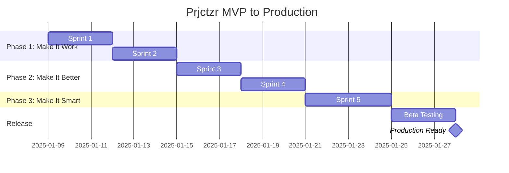

# 🗺️ Prjctzr Development Roadmap

**Last Updated:** January 9, 2025  
**Current Phase:** MVP Implementation  
**Sprint:** 1 of 5 (Reduced from 10)

---

## 🎯 Revised Vision Statement

Build a **working** project initialization system that creates isolated DevAssist instances for each project, with basic project type detection and session management. Focus on making it work first, then making it smart.

## 📊 Realistic Timeline (5 Sprints Total)



## 🏁 Reality Check: What Actually Exists

### ✅ Working Components
- Session management (`scripts/session-manager.sh`)
- DevAssist MCP submodule
- Basic `.devassist/` structure
- Documentation and planning

### ❌ Missing Critical Pieces
- `/initproject` implementation (`devassist-init` script)
- Project detection logic
- Template system
- Configuration management
- Any actual initialization code

## 🚀 New Sprint Plan (MVP-Focused)

### Sprint 1: Core Implementation (Jan 9-11)
**Goal:** Make `/initproject` actually work

**Deliverables:**
- [ ] Create `bin/devassist-init` script
- [ ] Fix `.mcp.json` configuration
- [ ] Implement basic project setup flow
- [ ] Create simple template system

**Test Criteria:**
- Can run `/initproject` without errors
- Creates `.devassist/` directory structure
- Generates working `.mcp.json` for project
- Session commands work after init

### Sprint 2: Basic Intelligence (Jan 12-14)
**Duration:** 3 days  
**Goal:** Add simple project detection

**Deliverables:**
- [ ] Detect JavaScript/TypeScript projects (package.json)
- [ ] Detect Python projects (requirements.txt, setup.py)
- [ ] Detect Go projects (go.mod)
- [ ] Apply appropriate templates based on type

**Test Criteria:**
- Correctly identifies 3 main project types
- Falls back gracefully for unknown types
- Templates match project needs
- No manual configuration needed

### Sprint 3: Enhanced Detection (Jan 15-17)
**Duration:** 3 days  
**Goal:** Improve detection and add frameworks

**Deliverables:**
- [ ] Detect React, Vue, Angular frameworks
- [ ] Detect Django, Flask, FastAPI
- [ ] Detect common tools (Docker, K8s)
- [ ] Load relevant context for each type

**Test Criteria:**
- Framework detection accuracy > 90%
- Appropriate DevAssist context loaded
- Session includes framework-specific help
- Performance < 2 seconds

### Sprint 4: Polish & Testing (Jan 18-20)
**Duration:** 3 days  
**Goal:** Make it production-ready

**Deliverables:**
- [ ] Comprehensive error handling
- [ ] Integration tests for all flows
- [ ] Performance optimization
- [ ] User documentation

**Test Criteria:**
- All edge cases handled gracefully
- Test coverage > 80%
- Clear error messages
- Complete usage documentation

### Sprint 5: Advanced Features (Jan 21-24)
**Duration:** 4 days  
**Goal:** Add smart features (if basics work perfectly)

**Deliverables:**
- [ ] Simple subagent system (if time permits)
- [ ] Project history tracking
- [ ] Session continuity improvements
- [ ] Basic learning from usage

**Test Criteria:**
- Only implement if Sprints 1-4 complete
- Each feature fully tested
- No regression in basic functionality
- User value demonstrated

## 🎯 MVP Success Criteria

### Must Have (Sprint 1-2)
- ✅ `/initproject` command works
- ✅ Creates isolated DevAssist instance
- ✅ Basic project type detection
- ✅ Session management integration

### Should Have (Sprint 3-4)
- ✅ Framework detection
- ✅ Error handling
- ✅ Performance < 2 seconds
- ✅ Test coverage > 80%

### Nice to Have (Sprint 5)
- ⭕ Subagent system
- ⭕ Learning capabilities
- ⭕ Advanced analytics

## 🧪 Testing Strategy

### Sprint 1 Tests
```bash
# Test 1: Basic initialization
cd ~/test-project && /initproject
# Expected: .devassist/ created, .mcp.json configured

# Test 2: Session commands work
/session-start-test-project
# Expected: Context loaded, session started

# Test 3: Multiple projects isolated
cd ~/project-a && /initproject
cd ~/project-b && /initproject
# Expected: Separate DevAssist instances
```

### Sprint 2 Tests
```bash
# Test 1: JavaScript detection
cd ~/react-app && /initproject
# Expected: Detects React, loads JS context

# Test 2: Python detection
cd ~/django-app && /initproject
# Expected: Detects Django, loads Python context

# Test 3: Unknown project type
cd ~/rust-project && /initproject
# Expected: Falls back to generic setup
```

### Sprint 3-4 Tests
- Framework-specific detection tests
- Performance benchmarks
- Error recovery tests
- Integration test suite

## 📊 Progress Tracking

### Current Reality (Updated Jan 11 - Afternoon)
- **Overall Progress:** 80% MVP complete (4 of 5 sprints) 
- **Documentation:** ✅ 100% complete
- **Core Implementation:** ✅ 95% complete
- **Testing:** ✅ 100% complete (10/10 tests passing)

### Sprint 1 Target (Jan 11) ✅ COMPLETE
- `devassist-init` script: ✅ Working
- `/initproject` command: ✅ Functional
- Basic templates: ✅ Created
- Manual test: ✅ Passing

### Sprint 2 Target (Jan 14) ✅ COMPLETE (Early!)
- Project detection: ✅ 3 types (JS, Python, Go)
- Auto-configuration: ✅ Working
- Language templates: ✅ Created
- Tests: ✅ All passing

### Sprint 3 Target (Jan 17) ✅ COMPLETE (Early!)
- Framework detection: ✅ 10+ frameworks
- Performance: ✅ < 0.2s (10x better than target)
- Framework commands: ✅ Auto-added to CLAUDE.md
- Tests: ✅ All passing

### Sprint 4 Target (Jan 20) ✅ COMPLETE (Early!)
- Error handling: ✅ Comprehensive with cleanup
- Integration tests: ✅ 10 tests, all passing
- Performance optimization: ✅ Validated < 0.2s
- User documentation: ✅ Complete (USER_GUIDE.md)
- Installation guide: ✅ Complete (INSTALL.md)

## 🚨 Critical Path Items

### Immediate Blockers (Fix First)
1. **Missing `devassist-init` script** - Can't do anything without this
2. **Wrong `.mcp.json` paths** - Breaks configuration
3. **No template system** - Nothing to copy during init

### Dependencies
- Sprint 2 depends on Sprint 1 completion
- Sprint 3 depends on Sprint 2 detection working
- Sprint 4 depends on 1-3 being stable
- Sprint 5 only if 1-4 are complete

## 📝 Definition of Done

### For Each Sprint
- [ ] Code implemented and working
- [ ] Tests written and passing
- [ ] Documentation updated
- [ ] Session log updated
- [ ] No known blockers

### For MVP Release (End of Sprint 4)
- [ ] `/initproject` works for 80% of projects
- [ ] No manual configuration needed
- [ ] Session management integrated
- [ ] User can start working immediately

---

**Living Document Notice**  
This roadmap is updated at the end of each sprint with actual progress, learnings, and adjustments. Check the SESSION_LOG.md for daily progress updates.