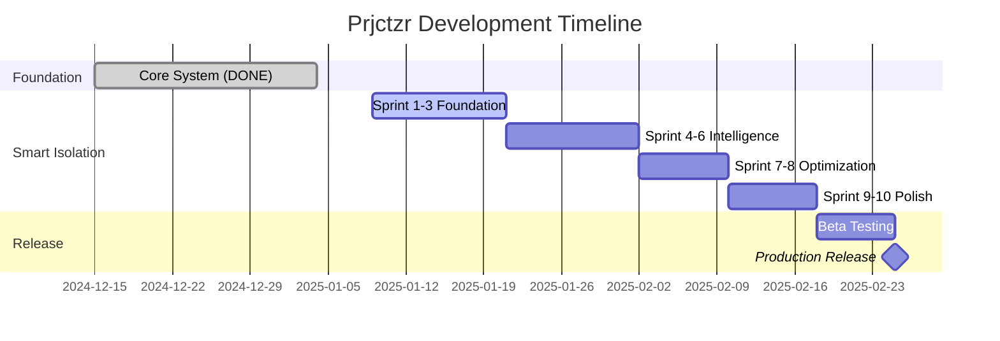

# 🗺️ Prjctzr Development Roadmap

**Last Updated:** January 9, 2025  
**Current Phase:** Smart Isolation Development  
**Sprint:** Ready for Sprint 1 of 10

---

## 🎯 Vision Statement

Build an intelligent project initialization system where every project gets its own isolated, context-aware AI assistant that automatically adapts to the project's specific needs without any manual configuration.

## 📊 Project Timeline

## 🏁 Completed Milestones

### ✅ Phase 0: Core Initialization System (COMPLETE)
**Timeline:** December 2024 - January 4, 2025  
**Sprints:** 5 sprints completed

**Delivered:**
- Basic `/initproject` command
- DevAssist MCP integration
- Session management commands
- Terminal logging system
- Project isolation foundation

## 🚧 Current Development: Smart Isolation

### Phase 1: Foundation (Sprints 1-3)
**Timeline:** January 9-21, 2025  
**Status:** Ready to Start

#### Sprint 1: Core Architecture Refactor
**Duration:** 3-4 days  
**Goals:**
- Simplify to 2 commands per project
- Build ProjectAnalyzer class
- Create SubagentRegistry
- Set up testing framework

**Deliverables:**
- [ ] Simplified command structure
- [ ] Project analysis engine
- [ ] Subagent loading system
- [ ] Test suite foundation

#### Sprint 2: Dynamic Loading System
**Duration:** 3-4 days  
**Goals:**
- Implement dynamic subagent loading
- Create subagent interface
- Build activation triggers
- Add configuration system

**Deliverables:**
- [ ] Dynamic loader implementation
- [ ] Subagent base class
- [ ] Trigger detection system
- [ ] Configuration management

#### Sprint 3: Memory Isolation
**Duration:** 3-4 days  
**Goals:**
- Implement isolated vector databases
- Create memory management system
- Build knowledge accumulation
- Add search capabilities

**Deliverables:**
- [ ] Isolated ChromaDB instances
- [ ] Memory manager class
- [ ] Knowledge persistence
- [ ] Semantic search integration

### Phase 2: Intelligence (Sprints 4-6)
**Timeline:** January 21 - February 2, 2025  
**Status:** Planning

#### Sprint 4: Web Development Subagent
**Duration:** 3-4 days  
**Focus:** React, Vue, Angular detection and assistance

#### Sprint 5: Backend & API Subagents
**Duration:** 3-4 days  
**Focus:** REST, GraphQL, database assistance

#### Sprint 6: Specialized Subagents
**Duration:** 3-4 days  
**Focus:** Blockchain, DevOps, Testing subagents

### Phase 3: Optimization (Sprints 7-8)
**Timeline:** February 2-10, 2025  
**Status:** Planning

#### Sprint 7: Performance Optimization
**Duration:** 3-4 days  
**Focus:**
- Load time optimization
- Memory efficiency
- Token usage reduction
- Cache implementation

#### Sprint 8: Error Handling & Edge Cases
**Duration:** 3-4 days  
**Focus:**
- Robust error handling
- Edge case coverage
- Recovery mechanisms
- Fallback strategies

### Phase 4: Polish (Sprints 9-10)
**Timeline:** February 10-18, 2025  
**Status:** Planning

#### Sprint 9: Testing & Quality
**Duration:** 3-4 days  
**Focus:**
- Comprehensive testing
- Bug fixes
- Performance validation
- Security audit

#### Sprint 10: Documentation & Release
**Duration:** 3-4 days  
**Focus:**
- User documentation
- API documentation
- Release preparation
- Migration guides

## 🎯 Success Criteria

### Technical Metrics
- ⏱️ Session start < 2 seconds
- 🎯 90%+ correct subagent activation
- 💾 30-40% token usage reduction
- 🧪 95%+ test coverage
- 🔒 Zero cross-project contamination

### User Experience Goals
- Zero configuration for common projects
- Intuitive 2-command interface
- Seamless session continuity
- Project-specific intelligence
- Progressive enhancement over time

## 🚀 Release Plan

### Beta Release (February 18, 2025)
- Limited testing with selected projects
- Feedback collection
- Performance monitoring
- Bug tracking

### Production Release (February 25, 2025)
- Full feature set
- Complete documentation
- Migration tools
- Support infrastructure

## 📈 Future Roadmap (v2.0)

### Q2 2025 - Collaboration Features
- Team shared memory
- Collaborative sessions
- Knowledge sharing
- Code review integration

### Q3 2025 - Cloud Integration
- Cloud memory sync
- Distributed sessions
- Backup and restore
- Cross-device support

### Q4 2025 - Ecosystem Expansion
- Plugin marketplace
- Custom subagent SDK
- Template library
- Community contributions

## 🔄 Iteration Process

### Sprint Cadence
- **Duration:** 3-4 days per sprint
- **Planning:** Start of each sprint
- **Review:** End of each sprint
- **Retrospective:** After each phase

### Quality Gates
Each sprint must pass:
1. All tests passing
2. Documentation updated
3. Code review completed
4. Performance benchmarks met

## 📝 Risk Management

### High Priority Risks
1. **Complex project detection**
   - Mitigation: Fallback patterns
   - Contingency: Manual override

2. **Performance degradation**
   - Mitigation: Profiling and optimization
   - Contingency: Selective feature loading

3. **Memory isolation failures**
   - Mitigation: Strict boundaries
   - Contingency: Process isolation

## 🤝 Stakeholder Communication

### Weekly Updates
- Sprint progress
- Blockers and risks
- Metric tracking
- Next week planning

### Phase Reviews
- Deliverable demonstration
- Metric evaluation
- Feedback integration
- Next phase planning

## 📊 Progress Tracking

### Current Status
- **Overall Progress:** 40% complete
- **Core System:** ✅ 100% complete
- **Smart Isolation:** 🚧 0% complete (starting)
- **Documentation:** 📝 60% complete
- **Testing:** 🧪 30% complete

### Next Milestone
**Sprint 1 Completion** - January 12, 2025
- ProjectAnalyzer implemented
- SubagentRegistry created
- Test framework established
- 2-command structure ready

---

**Living Document Notice**  
This roadmap is updated at the end of each sprint with actual progress, learnings, and adjustments. Check the SESSION_LOG.md for daily progress updates.